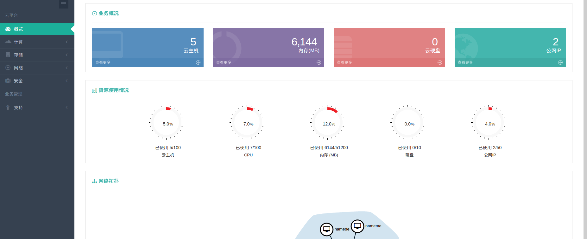
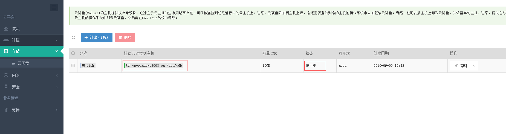
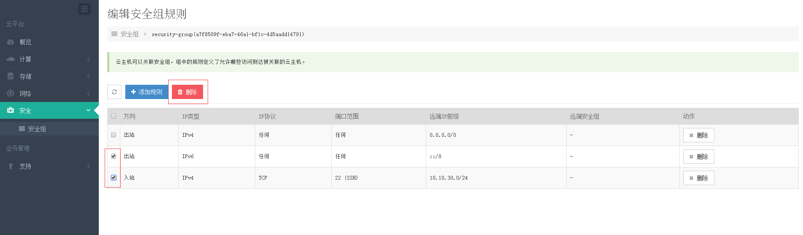

### 一.登陆
####  1.登陆
 

### 二.概览
####   1.概览   
 如图所示，输入账号和密码后，点击【登录】按钮，跳转至概览页面，如下图所示：
 

####   2.概览介绍
 > 业务情况:显示云主机的资源创建以及使用情况;资源使用的总内存情况,云硬盘的使用情况,网络资源中公网IP的使用情况;

 > 资源使用情况:显示资源占配额资源分配的百分比;

 > 网络拓扑:显示云主机的拓扑连接情况;

### 三.计算

###   云主机
####  1.1 云主机的创建
      1.1.1 创建云主机
  

      1.1.2 选择需要创建的镜像，选择下一步。
  

    1.1.3  选择虚拟机规格，选择下一步
  

   注:这里网络选择为自己创建的私有网络，详见第一章第五节网络中创建私有网络 

    1.1.4  虚拟机器用户设置，填好对应信息后选择提交，虚拟机开始创建,这里密码要复杂复杂性要求
  

    1.1.5 开始安装云主机
  

    1.1.6 若出现下图中云主机状态是运行的，则表示云主机创建成功
   
 
####  1.2 云主机操作
    1.2.1 云主机的关机，右侧操作下拉列表选择关机，如下
   
    
   如下图，选择确定，确认关机

   
   
   若状态显示为下，关机成功

   

    1.2.2  云主机VNC登陆，右侧操作下拉列表选择VNC登陆，如下
   
    
   

   输入创建虚拟机时候指定的密码即可登陆
    
    1.2.3  云主机绑定公网IP
   　此操作需要先申请公网IP,申请路由器，并且虚拟机所在私有网络已经和申请的路由器进行连接，具体操作详见网络章节里面的路由器

   
    1.2.4 编辑安全组，右侧操作下拉列表选择编辑安全组，如下

   

   选择已经创建好的安装安全组策略，如下 
  
   

    注:这里安全组选择为已经创建的安全组，详见第一章第六节安全组相关信息 
    
    1.2.5 挂载云硬盘,，右侧操作下拉列表选择挂载云硬盘，如下

   

   选择已经创建好的云硬盘和需要挂载硬盘的云主机，如下

   

    注:这里挂载的云硬盘为已经创建的，详见第一章第四节存储中云硬盘的相关信息 

    1.2.6 云主机的删除，右侧操作下拉列表选择删除，如下

   

### 镜像
#### 2.1 镜像查看

    2.1.1 这里可以看到所有平台内所有可以用的镜像文件

  

### 公网IP
#### 3.1 申请公网IP
　资源池选择浮动IP池，选择要使用的带宽,然后点击确定

之后会在IP列表里新增一个新地址,如下图

注:这里地址刚申请完,还没有关联资源，所以状态为已下线

#### 3.2 绑定公网IP

3.2.1 选则需要绑定公网IP的资源服务器

注:这里将要绑定IP的资源需要连接到路由器上，否则绑定列表里没有对应的该资源

3.2.2 绑定到资源后的地址状态

关联资源是绑定这个公网IP的资源信息，状态更新为运行中

3.2.3 解除到资源的绑定

解除绑定之后,该公网IP又恢复到没有关联资源,已下线的状态

#### 3.3 释放公网IP

该公网IP释放后,会重新放到平台公网地址池里,供用户进行申请

### 四.存储
### 云硬盘
> 云硬盘(Volume)为主机提供块存储设备，它独立于云主机的生命周期而存在，可以被连接到任意运行中的云主机上。注意，云硬盘附加到主机上后，您还需要登陆到您的主机的操作系统中去加载该云硬盘。当然，也可以从主机上卸载云硬盘、并转至其他主机。注意，请先在您的云主机的操作系统中卸载云硬盘，然后再在EonCloud系统中卸载。

####  1.1 创建云硬盘

 创建云硬盘之后,可以使用编辑修改云硬盘的名字

  1.1.1 云硬盘状态
创建云硬盘后,还没有挂载到主机，状态如下

####  1.2 删除云硬盘

注:删除云硬盘前，请确保数据做好相应的备份,否则数据无法恢复

#### 1.3 挂载云硬盘

选择需要挂载的主机，然后点击挂载

云硬盘挂载中

挂载后云硬盘状态,

然后登陆到云主机中,对挂载的云硬盘进行分区使用

#### 1.4 卸载云硬盘

注:在弹出的对话框中选择确定,卸载之前请确保在云主机内部umount掉对应的磁盘

1.4.1 云硬盘卸载后状态如下

### 　五.网络
### 私有网络
> 私有网络会在您建立第一台云主机时打包为您一起创建，用于您各主机之间的连通，并且各网络之间100%隔离，保障安全。

#### 1.1 私有网络创建
需要指定名称和网络地址,没有开启高级选项,vlan是自动划分的

开启高级选项，可以配置VLAN和网关,网络组网更灵活

#### 1.2 连接路由器

1.2.1 选中私有网络,选择连接路由器,会跳到路由器选择界面

1.2.2 路由器选择界面

1.2.3 点击需要连接到的路由器,进入到添加接口的界面,点击增加接口(链接网络)按钮

1.2.4 选择对应的私有网络接口

注:指定IP地址是可选项,可以作为网关,默认的是使用该段的第一个地址，比如10.10.30.0/24,则是使用10.10.30.1作为网关

1.2.5 连接路由器后,路由器详情状态如下

#### 1.3 删除私有网络
删除私有网络,要确保断开所有连接,包括路由器,和云主机

1.3.1 批量删除私有网络
选中需要删除私有网络，点击上面标题栏的删除按钮

1.3.2 删除指定私有网络
选中需要删除的私有网络,点击右侧操作栏下编辑右侧的下拉箭头,选择里面的删除按钮

### 路由器
>  用于私有网络之间的连通，同样可以和私有网络一起伴随云主机的创建而生成并提供多种基本与高级服务。设置公网网关后，您的路由器将可以访问互联网。

#### 2.1 创建路由器
2.1.1 创建路由器,指定路由器的名称,选择对应的外网接口地址池,外部网关

2.1.2 路由器创建好后,状态如下图所示

2.1.3 路由器编辑,这里可以修改路由器的显示

#### 2.2 路由器连接私有网络
2.2.1路由器连接私有网络,选择要添加私有网络的路由器

2.2.2 在路由器详情界面,选择增加接口(链接网络)

2.2.3 选择要连接的私有网络

如果不选择指定IP地址,这里默认分配找个私有网络的第一个可用地址,如下

这里可以指定地址,找个地址为路由器连接私有网络接口的地址,然后提交

指定IP地址后,显示如下

#### 2.3  删除路由器接口
2.3.1 批量删除路由器接口,选中需要删除的私有网络接口,点击功能菜单栏的删除

删除后效果如下

2.3.2 删除路由器指定接口
选中需要删除的私有网络,点击右侧操作栏下面点击删除按钮

 
#### 2.4 删除路由器
2.4.1 清除路由器网关
删除对应路由器的外网网关

删除后显示如下,相对应的清除网关选项变为设置网关,点击设置网关可以为路由器添加外部网关

2.4.2 删除路由器
批量删除同批量删除路由器接口

删除指定路由器,

### 负载均衡器
> 负载均衡器（Load Balancer）可以将来自多个公网地址的访问流量分发到多台主机上，并支持自动检测并隔离不可用的主机，从而提高业务的服务能力和可用性。同时，你还可以随时通过添加或删减主机来调整你的服务能力，而且这些操作不会影响业务的正常访问。另外，负载均衡器还支持灵活配置多种转发策略，实现高级的自定义转发控制功能；支持 HTTP/HTTPS/TCP 三种监听模式，并支持透明代理，可以让后端主机不做任何更改，直接获取客户端真实 IP。

#### 3.1 创建负载均衡器
3.1.1 创建负载均衡器,基础配置根据业务需求选择子网,协议,端口,和调度算法,然后选择下一步

3.1.2 选择负载主机,启用服务,并配置端口，如下,配置完成后选择下一步

3.1.3  配置健康检查策略,然后提交

3.1.4 配置完效果如下

#### 3.2 负载均衡器编辑

打开界面后如下,根据需要选择编辑

注:基础配置可以更改负载均衡器名字和调度算法;健康建检查可以更改检测间隔,重试次数和心跳超时时间

#### 3.3 负载均衡器绑定公网IP
3.3.1 到计算公网IP菜单,选择指定的公网IP右侧动作下拉箭头选择绑定到公网IP

3.3.2  选择负载均衡器资源

3.3.3 公网IP绑定到主机

#### 3.4 负载均衡器的删除
负载均衡器的批量删除

指定负载均衡器删除

### 网络拓扑
> 在拓扑图上滚动您的鼠标/触控板来调整画布大小, 单击空白处并拖拽可以移动画布

#### 4.1  查看网络拓扑

###  六.安全
### 安全组
> 基于安全的考虑，安全组采用白名单的安全策略来隔离外部对云主机的访问，安全组被安放在主机和路由器之间，用户可以自定义开放22，80，3389等端口规则。

#### 1.1 创建安全组

创建好后如下

#### 1.2 编辑安全组规则
> 云主机可以关联安全组，组中的规则定义了允许哪些访问到达被关联的云主机。

1.2.1 进入安全组规则编辑

1.2.2 添加规则,创建了安全组默认只有出站的规则

1.2.3 添加入站的自定义规则,可根据实际需求配置对应的规则

创建后如下

#### 1.3 删除安全组规则
1.3.1 批量删除安全组规则

1.3.2 删除指定安全组规则

#### 1.4 删除安全组

# 业务管理
### 支持
### 操作日志
> 操作日志基于用户行为自动提取，为用户提供安全的行为分析。

#### 1.1 查看操作日志,可以根据类型查找对应的日志信息

### 工单
> 工单系统是云管理控制台为您提供的最简单有效的帮助功能，您可以通过工单支持来提问任何问题需求帮助，我们将会竭尽全力为您解答。同样，我们也欢迎您提出的宝贵意见和建议。

略

  

     
  
   
