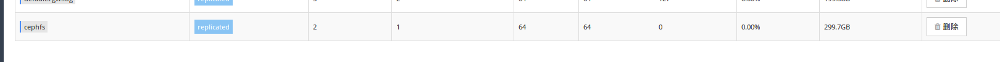
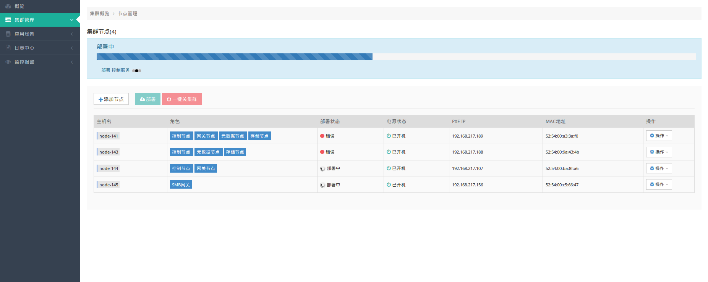

# 安装流程
####  1. 登陆
- 1.1 登录
> 输入用户名和密码即可登录Unistor管理端,进行查看和日常运维管理等操作

 

- 1.2 概览

> 概览页面可以显示Unistor集群的整体运行状态,包括集群信息,性能信息和节点信息

  

#### 2. 集群管理

- 2.1 节点管理
> 这里显示集群里的的节点信息,主机名,角色,部署状态,电源状态,pxe ip,mac 地址和一些对节点添加,删除,部署等操作,如图这里显示一个各个节点部署完成的状态

- 2.2 pool管理
> 这里主要是显示pool的信息,针对pool的创建和删除
 

如下图,显示的是部署完之后的pool节点

2.2.1 创建pool
> 类型，存储策略介绍，PG数,副本数介绍
    根据所选节点类型不同,每次部署集群完成后的pool数量类型会不同

点击左上角创建pool,出现如下界面,根据集群情况修改参数,然后选择提交

2.2.2 删除pool

点击pool后面的删除操作,在出现的提示界面选择确认按钮,即可删除,如下:

- 2.3 osd管理
> 描述,参数描述
这里显示每个节点的存储盘和日志盘的对应关系,状态,以及一些针对osd进行的操作,参数修改等

如下图,显示的是部署完之后的osd节点

- 2.4 创建集群
> 部署Unistor集群

　2.4.1 添加节点,点击添加节点,在出现的列表中选择节点,并分配角色,点击右上角添加,如下:
  
    
  
    2.4.2 依次添加其他节点,最终结果如下:
  

   ==最少选择2个存储节点==

   2.4.3 修改角色
    在选择角色添加节点后,还可以修改所选节点的角色,操作选项卡,下拉箭头选择编辑角色,如下:
    
     点击提交,修改节点角色

  
  2.4.4 配置节点网络

   > 节点目前三个网络,pxe,public和cluster网络,分别对应三个网卡

   操作选项卡,下拉箭头选择配置网络,如下:
   

   拖动客户网络,集群网络到特定角色的网卡上,点击右下角应用,如下图:
   

  
  2.4.5  配置节点硬盘
   > 配置硬盘,有系统分区,osd分区和journal分区,osd分区和journal分区针对存储节点,其他节点只需要选择系统盘分区即可

  操作选项卡,下拉箭头选择配置硬盘,点击右上角应用,如下:
  

  ==针对osd和jouranl分区,比例是1:1,一块osd对应一块journal==

   所有节点配置完成后如下:
  

  2.4.6 部署集群
   > 开始部署集群

 上面的网络和硬盘分区配置好后，即可点击部署-确认按钮，集群开始部署,根据节点数量,部署时间会有所差异,如下:
    
　
   若在部署过程中出现错误,对应节点的部署状态会错误,如下:
    
   出现错误,需要先排查错误原因,然后在重新部署
   
   移除节点,然后等节点从pxe启动,重新添加节点,重复2.4步骤

 -  2.5 节点操作
   点击电源状态的电脑图标,可以打开节点的webshell终端
   操作选项卡,下拉箭头选择重启,即可对节点进行重启操作
   操作选项卡,下拉箭头选择关机,即可对节点进行关机操作
   操作选项卡,下拉箭头选择部署详情,即可查看部署过程

#### 3. 应用场景
 - 3.1 文件系统
> 参数介绍,数据池,元数据池,删除速度
Unistor集群是一个分布式文件系统,通过对数据提供副本和自动恢复功能，对集群提供高可用和高容错性能

  3.1.1  创建文件系统
   左上角点击创建按钮,输入文件系统名称,选择数据池和元数据池,然后提交,如下:
   
   
   创建完成后如下:
   

   右侧详情可以查看文件系统的详情,下拉箭头可以查看会话，和进行主备切换

- 3.2 SMB共享
> SMB共享
基于Unistor集群文件系统的Samba共享,可以方便各种客户端的访问和数据应用

点击左上角创建SMB共享,在弹出的页面指定共享名,选择刚刚创建的文件系统,选择权限,然后点击确认,如下:

==创建smb共享,必须部署的节点里面有SMB网关角色==

创建共享完成后如下,可以点击右侧编辑进行权限的更改,下拉箭头选择进行删除操作

#### 4. 日志中心
> 记录日志

- 4.1 日志检索

> 在这里查看Unistor集群的日志信息,可以根据日志类型,主机,日志级别，关键字,时间段去进行查询

指定日志进行查询,如下查询日志类型为Unistor,主机为node-146的INFO日志:

- 4.2 操作日志
记录页面操作的日志

#### 5 .监控报警

> 针对节点和集群的监控和报警

- 5.1 节点监控

5.1.1 主机监控

> 节点的监控(cpu,network,disk)

点击绿色背景节点右下角的查看监控详情,切换监控项,即可看到节点的不同项目的监控信息，如下:

5.1.2 主机报警

> 针对定制监控项的报警

点击左上角的创建,针对指定主机添加监控策略，然后提交,如下:

右侧下拉箭头可对策略进行禁用,编辑,删除等操作

- 5.2 集群监控

> 针对集群的监控和报警

5.2.1 集群监控
集群的部分性能统计信息，点击对应模块下面的查看详情可以查看详细信息

5.2.2 集群报警
> 针对指定的监控项目和值,当触发的时候就会发送邮件进行报警
点击左上角的创建,指定相应的条件,点击提交,即可创建集群报警策略

#### 6.  troubleshooting
