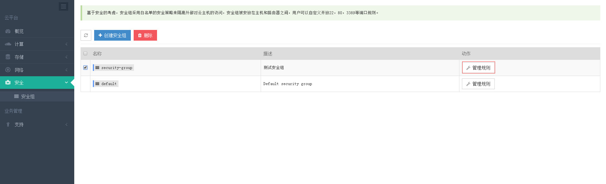
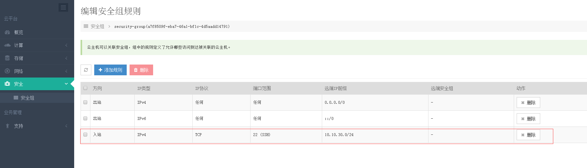
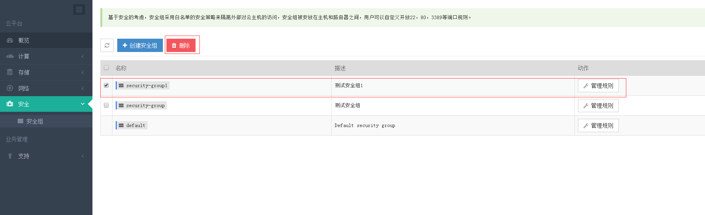

###  六.安全
### 安全组
> 基于安全的考虑，安全组采用白名单的安全策略来隔离外部对云主机的访问，安全组被安放在主机和路由器之间，用户可以自定义开放22，80，3389等端口规则。

#### 1.1 创建安全组

创建好后如下

#### 1.2 编辑安全组规则
> 云主机可以关联安全组，组中的规则定义了允许哪些访问到达被关联的云主机。

1.2.1 进入安全组规则编辑

1.2.2 添加规则,创建了安全组默认只有出站的规则

1.2.3 添加入站的自定义规则,可根据实际需求配置对应的规则

创建后如下

#### 1.3 删除安全组规则
1.3.1 批量删除安全组规则

1.3.2 删除指定安全组规则

#### 1.4 删除安全组

# 业务管理
### 支持
### 操作日志
> 操作日志基于用户行为自动提取，为用户提供安全的行为分析。

#### 1.1 查看操作日志,可以根据类型查找对应的日志信息

### 工单
> 工单系统是云管理控制台为您提供的最简单有效的帮助功能，您可以通过工单支持来提问任何问题需求帮助，我们将会竭尽全力为您解答。同样，我们也欢迎您提出的宝贵意见和建议。

略

